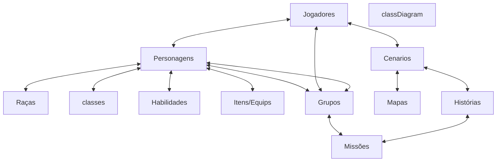

```mermaid
graph TD;

per[Personagens]
rac[Raças]
cla[classes]
hab[Habilidades]
equip[Itens/Equips]
gru[Grupos]
map[Mapas]
cen[Cenarios]
mi[Missões]
jog[Jogadores]
his[Histórias]

classDiagram
    jog <--> per <--> gru
    jog <--> gru
    per <--> rac
    per <--> cla
    per <--> hab
    per <--> equip
    per <--> gru
    gru <--> mi
    cen <--> map
    cen <--> his
    his <--> mi
    jog <--> cen

```